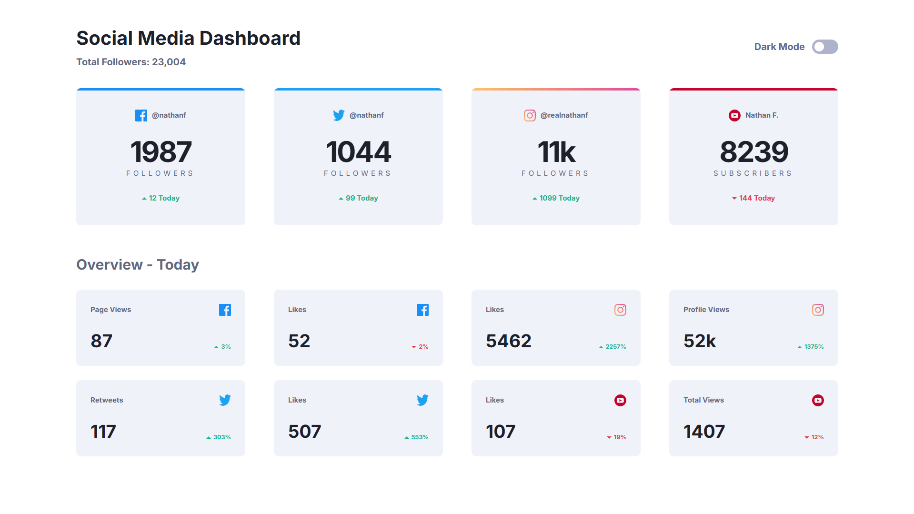
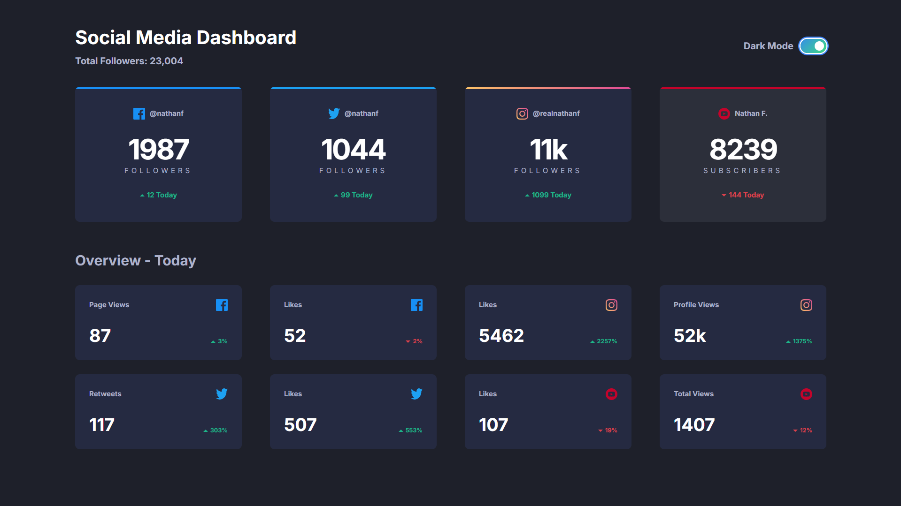
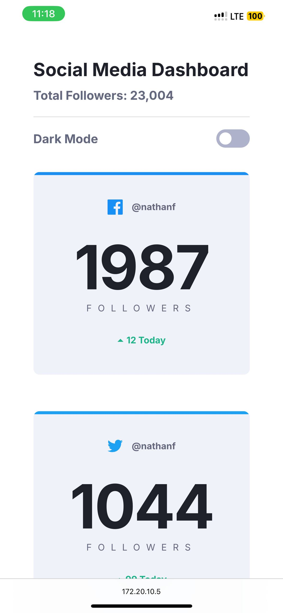
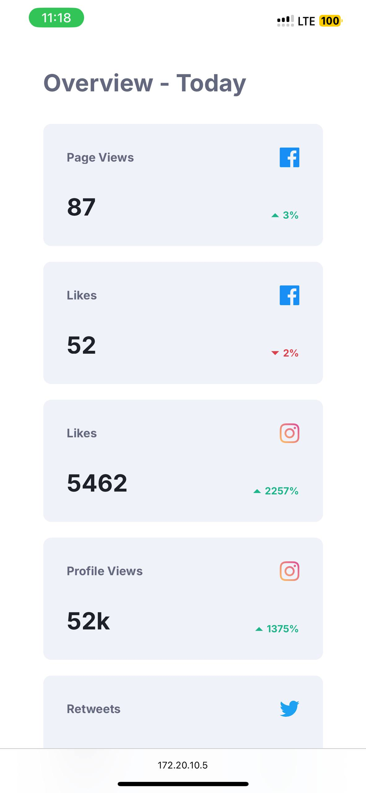
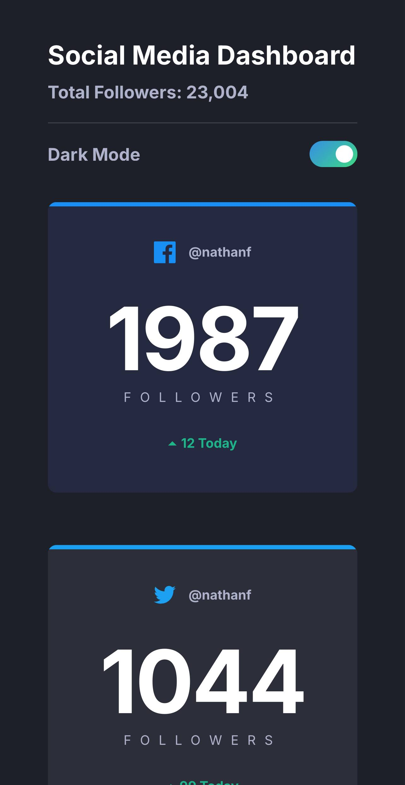
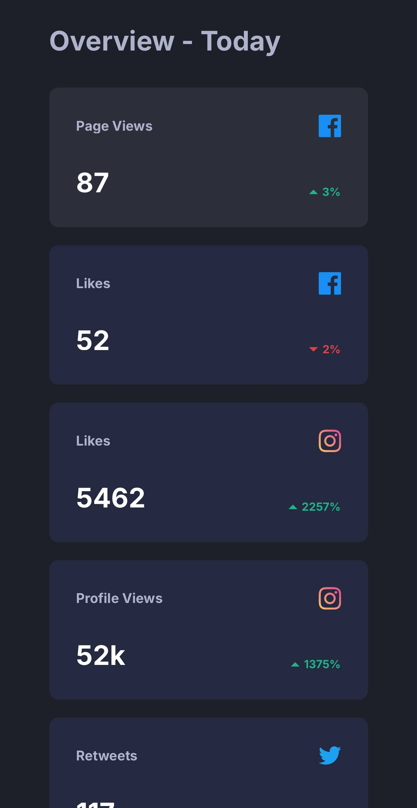

# Frontend Mentor - Social media dashboard with theme switcher solution

This is a solution to the [Social media dashboard with theme switcher challenge on Frontend Mentor](https://www.frontendmentor.io/challenges/social-media-dashboard-with-theme-switcher-6oY8ozp_H).

## Table of contents

- [Overview](#overview)
  - [The challenge](#the-challenge)
  - [Screenshots](#screenshots)
  - [Links](#links)
- [My process](#my-process)
  - [Built with](#built-with)
  - [What I learned](#what-i-learned)
  - [Continued development](#continued-development)
  - [Useful resources](#useful-resources)
- [Author](#author)

## Overview

### The challenge

Users should be able to:

- View the optimal layout for the site depending on their device's screen size
- See hover states for all interactive elements on the page
- Toggle color theme to their preference

### Screenshots

Desktop:




Mobile:








### Links

- [Solution](https://github.com/akcumeh/[sm-dashboard])
- [Live site](https://akcumeh.github.io/[sm-dashboard])

## My process

### Built with

- [React](https://reactjs.org/) - JS library
- [TailwindCSS](https://tailwindcss.com) - Utility-first CSS framework
- CSS Flexbox
- CSS Grid
- Mobile-first workflow

### What I learned

1. **TailwindCSS opacity modifier**: Given a color utility, the opacity can be set in shorthand:

```html
<div class="bg-secondary/25 w-[48px] h-[48px] m-auto p-auto">
    Box transparency: 25%
</div>
```

[Tailwind Docs](https://tailwindcss.com/docs/background-color#changing-the-opacity)

2. **Setting line height**: You can determine the amount of space above and below a piece of text like so:

```html
<div class="leading-[1.25] w-[48px] h-[48px] m-auto p-auto">
    Line height: 125%
    Line height: 125% also
</div>
<br />
<div class="text-md/[1.5] w-[48px] h-[48px] m-auto p-auto">
    Line height: 150%
    Line height: 150% also
</div>
```

[Tailwind Docs](https://tailwindcss.com/docs/line-height)

Read more about line heights here:

  - [line-height - CSS - MDN Web Docs](https://developer.mozilla.org/en-US/docs/Web/CSS/line-height)
  - [Google Fonts](https://fonts.google.com/knowledge/using_type/choosing_a_suitable_line_height)

3. **Customizing letter spacing**: You can set the `letterSpacing` property in the [Tailwind configuration](tailwind.config.js) with custom values, then use them in your code:

```html
<div class="tracking-wider w-[48px] h-[48px] m-auto p-auto">
    Letter Spacing
</div>
```

[Tailwind Docs](https://tailwindcss.com/docs/letter-spacing)

4. **Dynamic styling lookup**: I was used.

### Continued development

- The dynamic styling lookup I used in this project shares a few similarities with Sass/SCSS, so I look forward to trying it in my next project.
- I hope to build a proper mobile app for the next mobile design using React Native.

### Useful resources

- [Tailwind Docs](https://tailwindcss.com/docs/)

## Author

- Frontend Mentor - [@akcumeh](https://www.frontendmentor.io/profile/akcumeh)
- GitHub - [Angel Umeh](https://github.com/akcumeh)
- Twitter - [@akcumeh](https://x.com/akcumeh)